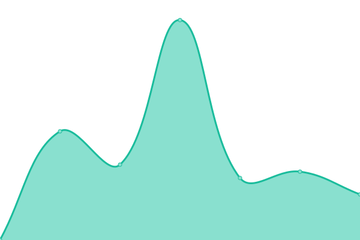

# [📈 Live Status](https://flourigh.github.io/upptime): <!--live status--> **🟧 Partial outage**

This repository contains the open-source uptime monitor and status page for [Roberto Monteiro](https://linkedin.com/in/flourigh), powered by [Upptime](https://github.com/upptime/upptime).

With [Upptime](https://upptime.js.org), you can get your own unlimited and free uptime monitor and status page, powered entirely by a GitHub repository. We use [Issues](https://github.com/flourigh/upptime/issues) as incident reports, [Actions](https://github.com/flourigh/upptime/actions) as uptime monitors, and [Pages](https://flourigh.github.io/upptime) for the status page.

<!--start: status pages-->
<!-- This summary is generated by Upptime (https://github.com/upptime/upptime) -->
<!-- Do not edit this manually, your changes will be overwritten -->
<!-- prettier-ignore -->
| URL | Status | History | Response Time | Uptime |
| --- | ------ | ------- | ------------- | ------ |
|  [Coplie](https://www.coplie.com) | 🟩 Up | [coplie.yml](https://github.com/flourigh/upptime/commits/HEAD/history/coplie.yml) | 

 191ms
     
 | 

<a href="https://flourigh.github.io/upptime/history/coplie">100.00%</a>
    

|  [Flow](https://n8n-xj4o.onrender.com/webhook/88e250e4-373d-44c5-98b3-c62e0713439a) | 🟥 Down | [flow.yml](https://github.com/flourigh/upptime/commits/HEAD/history/flow.yml) | 

 885ms
     
 | 

<a href="https://flourigh.github.io/upptime/history/flow">63.08%</a>
    

<!--end: status pages-->

[**Visit our status website →**](https://flourigh.github.io/upptime)

## 📄 License

- Powered by: [Upptime](https://github.com/upptime/upptime)
- Code: [MIT](./LICENSE) © [Anand Chowdhary](https://anandchowdhary.com), supported by [Pabio](https://pabio.com)
- Data in the `./history` directory: [Open Database License](https://opendatacommons.org/licenses/odbl/1-0/)
